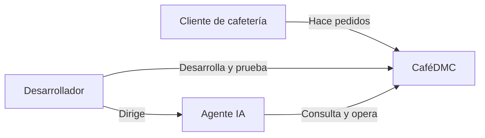
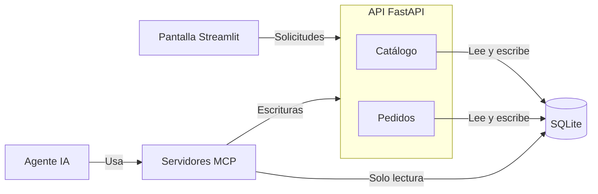

# Arquitectura de CaféDMC

## Contexto C4

```mermaid
flowchart LR
    cliente[Cliente de cafetería] -->|Hace pedidos| sistema[CaféDMC]
    desarrollador[Desarrollador] -->|Desarrolla y prueba| sistema
    agente[Agente IA] -->|Consulta y opera| sistema
    desarrollador -->|Dirige| agente
```

## Contenedores C4

```mermaid
flowchart LR
    pantalla[Pantalla Streamlit] -->|Solicitudes| api
    subgraph api[API FastAPI]
        catalogo[Catálogo]
        pedidos[Pedidos]
    end
    catalogo -->|Lee y escribe| sqlite[(SQLite)]
    pedidos -->|Lee y escribe| sqlite
    agente[Agente IA] -->|Usa| mcp[Servidores MCP]
    mcp -->|Solo lectura| sqlite
    mcp -->|Escrituras| api
```
